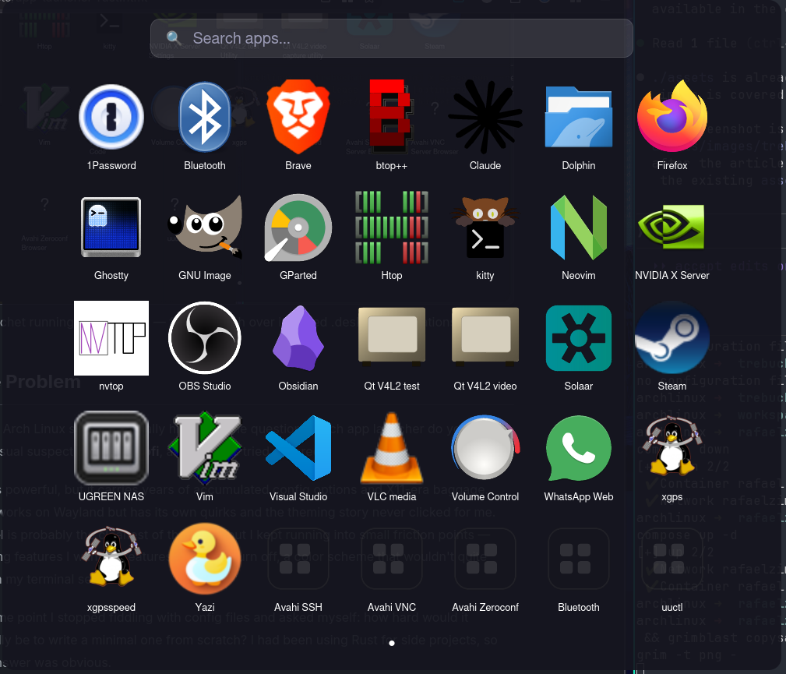

# trebuchet

An application launcher for Hyprland/Wayland.

Built with [iced](https://github.com/iced-rs/iced) and [iced-layershell](https://github.com/waycrate/exwlseat).

## Features

- Screen overlay using the Wayland layer-shell protocol
- Real-time fuzzy search across all installed applications
- Icon display from the system icon theme
- Escape to close
- Launches on the active screen



## Requirements

- A Wayland compositor supporting the `wlr-layer-shell` protocol (e.g. Hyprland, Sway)
- Rust toolchain (stable, 2021 edition or later)

## Install

```sh
sh -c "$(curl -fsSL https://raw.githubusercontent.com/rafaelzimmermann/trebuchet/main/scripts/install.sh)"
```

This clones the repository, fetches high-resolution icons for ~80 common apps, builds a release binary, and installs it system-wide to `/usr/local/bin`.

### Options

| Flag | Description |
|------|-------------|
| `--user` | Install to `~/.local/bin` instead of `/usr/local/bin` |
| `--no-icons` | Skip fetching high-resolution icons |
| `--uninstall` | Remove installed files |

Pass flags by cloning and running the script directly:

```sh
git clone --depth=1 https://github.com/rafaelzimmermann/trebuchet.git
bash trebuchet/scripts/install.sh --user
```

To uninstall:

```sh
bash trebuchet/scripts/install.sh --uninstall
```

### Bind to a key

Add this to your Hyprland config (`~/.config/hypr/hyprland.conf`):

```
bind = SUPER, Space, exec, trebuchet
```

## Setup from source

### 1. Fetch bundled icons (optional)

trebuchet ships a script that populates `assets/icons/` with high-resolution SVGs
for ~80 common applications. It checks locally installed icon themes first
(Papirus, Breeze, hicolor …) and falls back to downloading from
[Papirus on GitHub](https://github.com/PapirusIconTheme/papirus-icon-theme) (GPL-3.0).

```sh
bash scripts/fetch-icons.sh
```

These icons take priority over the system icon theme at runtime, so lower-resolution
or missing system icons are automatically covered. The fetched files are excluded from
version control (see `.gitignore`).

If you have Papirus installed (`pacman -S papirus-icon-theme` / `apt install papirus-icon-theme`),
the script works entirely offline.

### 2. Build and run

```sh
cargo run --release
```

## Usage

| Action | Effect |
|--------|--------|
| Type   | Filter applications by name |
| Click  | Launch application |
| Escape | Close launcher |

## Configuration

Configuration is currently baked in via `src/config.rs`. Default values:

| Setting | Default | Description |
|---------|---------|-------------|
| `columns` | `6` | Number of app columns in the grid |
| `icon_size` | `96` | Icon size in pixels |
| `background_opacity` | `0.85` | Background opacity (0.0–1.0) |

---

<a href="https://www.buymeacoffee.com/engzimmermy" target="_blank"></a>
