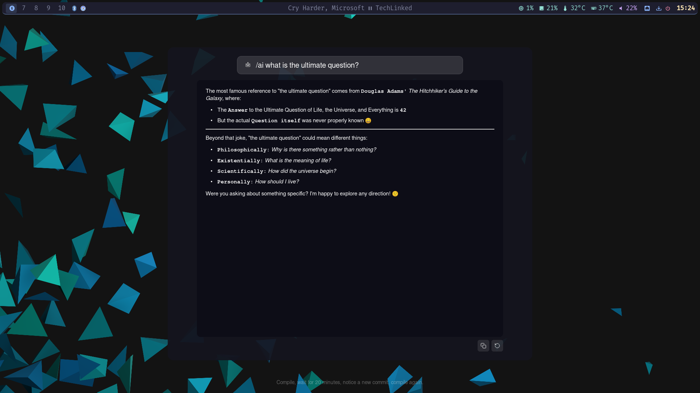

# trebuchet

An application launcher for Hyprland/Wayland.

Built with [iced](https://github.com/iced-rs/iced) and [iced-layershell](https://github.com/waycrate/exwlseat).

https://github.com/user-attachments/assets/3a6caffb-aa08-4783-8f2a-d0f1bb18a015


## Features

- Screen overlay using the Wayland layer-shell protocol
- Real-time search across all installed applications — type anywhere
- Icon display from the system icon theme (with bundled high-resolution fallbacks)
- Keyboard navigation with arrow keys and Enter to launch
- Terminal apps (`Terminal=true`) are auto-detected and launched in your terminal emulator
- Escape to close
- Launches on the active screen
- Built-in AI assistant — type `/ai <question>` to query OpenAI, Anthropic, Gemini, or a local Ollama model; switch between configured models on the fly with the bottom-left picker
- Custom commands — define shell shortcuts in config (e.g. `/shutdown`, `/uptime`) with optional output display


## Requirements

- A Wayland compositor supporting the `wlr-layer-shell` protocol (e.g. Hyprland, Sway)
- Rust toolchain (stable, 2021 edition or later)

## Install

```sh
sh -c "$(curl -fsSL https://raw.githubusercontent.com/rafaelzimmermann/trebuchet/main/scripts/install.sh)"
```

This clones the repository, fetches high-resolution icons for ~80 common apps, builds a release binary, and installs it system-wide to `/usr/local/bin`.

### Options

| Flag | Description |
|------|-------------|
| `--user` | Install to `~/.local/bin` instead of `/usr/local/bin` |
| `--no-icons` | Skip fetching high-resolution icons |
| `--uninstall` | Remove installed files |

Pass flags by cloning and running the script directly:

```sh
git clone --depth=1 https://github.com/rafaelzimmermann/trebuchet.git
bash trebuchet/scripts/install.sh --user
```

To uninstall:

```sh
bash trebuchet/scripts/install.sh --uninstall
```

### Bind to a key

Add this to your Hyprland config (`~/.config/hypr/hyprland.conf`):

```
bind = SUPER, Space, exec, trebuchet
```

## Setup from source

### 1. Fetch bundled icons (optional)

trebuchet ships a script that populates `assets/icons/` with high-resolution SVGs
for ~80 common applications. It checks locally installed icon themes first
(Papirus, Breeze, hicolor …) and falls back to downloading from
[Papirus on GitHub](https://github.com/PapirusDevelopmentTeam/papirus-icon-theme) (GPL-3.0).

```sh
bash scripts/fetch-icons.sh
```

These icons take priority over the system icon theme at runtime, so lower-resolution
or missing system icons are automatically covered. The fetched files are excluded from
version control (see `.gitignore`).

If you have Papirus installed (`pacman -S papirus-icon-theme` / `apt install papirus-icon-theme`),
the script works entirely offline.

### 2. Build and run

```sh
cargo run --release
```

## Usage

| Action | Effect |
|--------|--------|
| Type | Filter applications by name |
| Arrow keys | Move selection through the grid |
| Enter | Launch selected application |
| Click | Launch application |
| `/ai <question>` + Enter | Switch to AI assistant |
| `/cmd` + Space or Enter | Open custom command runner |
| `/config` + Space or Enter | Open settings panel |
| `/app` + Space or Enter | Return to app grid from any panel |
| Escape | Return to app grid (from any panel) |

## AI assistant

Type `/ai` followed by your question to query an AI provider directly from the launcher.



```
/ai what is a trebuchet
/ai how do I centre a div in CSS
```

The search bar icon switches to a robot while you are in AI mode. The response is rendered as formatted markdown — headings, code blocks, bold text, and links are all styled. Clicking a link opens it in your browser. The **copy** button sends the raw markdown to the clipboard so it pastes cleanly into any editor.

Press **Escape** to leave AI mode and return to the app grid without closing the launcher.

### Providers

| Provider | Config value | Needs API key |
|----------|-------------|---------------|
| OpenAI | `openai` | Yes |
| Anthropic | `anthropic` | Yes |
| Google Gemini | `gemini` | Yes |
| Ollama (local) | `ollama` | No |

### Configuring models

Define one `[[ai_model]]` block per provider. The `model` field accepts a comma-separated list — each model becomes a selectable entry in the picker shown at the bottom-left of the AI panel, labelled `provider:model`. The first model in the first block is the default.

```ini
# ~/.config/trebuchet/trebuchet.conf

[[ai_model]]
provider = anthropic
api_key  = sk-ant-api03-...
model    = claude-sonnet-4-6, claude-opus-4-6

[[ai_model]]
provider = openai
api_key  = sk-proj-...
model    = gpt-4o, gpt-4-turbo

[[ai_model]]
provider = ollama
model    = llama3.2, mistral
```

Each block supports these keys:

| Key | Required | Description |
|-----|----------|-------------|
| `provider` | Yes | `openai`, `anthropic`, `gemini`, or `ollama` |
| `api_key` | For cloud providers | Your API key |
| `model` | No | Comma-separated model IDs; falls back to the provider default if omitted |
| `base_url` | No | Override the API endpoint (useful for Ollama or compatible proxies) |

#### Single-model shorthand (legacy)

The older flat-key syntax still works and is equivalent to a single `[[ai_model]]` block:

```ini
ai_provider = anthropic
ai_api_key  = sk-ant-...
ai_model    = claude-sonnet-4-6
```

## Settings panel

Type `/config` (then Space or Enter) to open the settings panel. From there you can switch the colour theme:

```
theme <name>
```

Trebuchet looks for `.conf` files in `~/.config/trebuchet/themes/`. The panel lists all available themes at idle so you can see your options at a glance.

```sh
# Example: drop a theme file into place
cp my-theme.conf ~/.config/trebuchet/themes/my-theme.conf
# Then inside trebuchet:
# /config → theme my-theme
```

The Copy button copies the last command output (prompt + result) to the clipboard.

## Custom commands

Define shell shortcuts that trigger by typing a prefix and pressing Enter.

```ini
# ~/.config/trebuchet/trebuchet.conf

[[command]]
prefix  = /shutdown
command = shutdown -h now

[[command]]
prefix  = /reboot
command = reboot
```

Set `display_result = true` to capture stdout and show it in the response panel instead of closing the launcher:

```ini
[[command]]
prefix         = /uptime
command        = uptime -p
display_result = true

[[command]]
prefix         = /ip
command        = ip -br addr show
display_result = true
```

The `command` is executed with `sh -c`, so pipes, substitutions, and any shell built-in work. Multiple `[[command]]` blocks can be defined; they accumulate across config layers.

### Using the command runner

Type `/cmd` (then Space or Enter) to open the command runner panel. The idle view lists all configured prefixes. Type a prefix and press Enter to run it:

- Commands with `display_result = false` (default) run silently and close the launcher.
- Commands with `display_result = true` run asynchronously — a "Running…" indicator appears immediately; the output is shown in the panel when the command completes. The Copy button copies the prompt + output to the clipboard.

## Configuration

trebuchet reads `~/.config/trebuchet/trebuchet.conf` on startup. If the file does not
exist or a setting is missing, the built-in defaults apply.

```ini
# ~/.config/trebuchet/trebuchet.conf

columns   = 7
rows      = 5
icon_size = 96
```

| Setting | Default | Description |
|---------|---------|-------------|
| `columns` | `7` | Number of app columns in the grid |
| `rows` | `5` | Number of app rows per page |
| `icon_size` | `96` | Icon size in pixels |

---

<a href="https://www.buymeacoffee.com/engzimmermy" target="_blank"></a>
